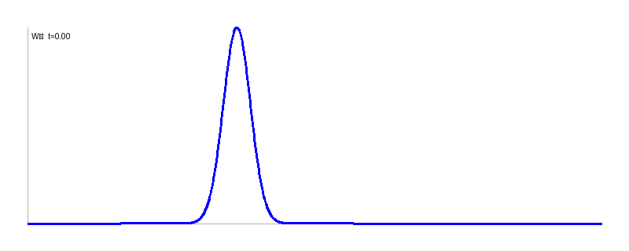
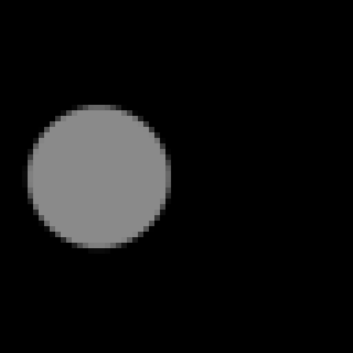

## $L^2$ vs $W_2$ distances{.layout-tc}

::: {.center-v}
::: {.columns}
::: {.column width="50%"}

:::

::: {.column width="50%"}

:::
:::
:::

---

::: {.center-v}
::: {.columns}
::: {.column width="50%"}

:::

::: {.column width="50%"}

:::
:::
:::